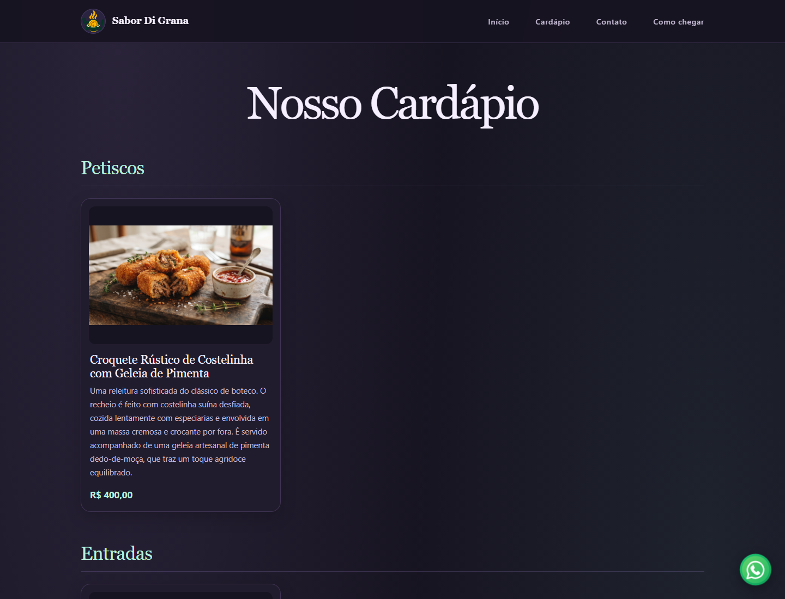

# Cardápio Digital

Aplicação web para apresentar o cardápio de um restaurante e administrar seus
produtos, categorias e informações institucionais. O sistema foi desenvolvido
com Django, usa SQLite por padrão e oferece uma interface administrativa própria
restrita a superusuários.

## Índice

- [Recursos](#recursos)
- [Arquitetura](#arquitetura)
- [Modelo de dados](#modelo-de-dados)
- [Rotas](#rotas)
- [Requisitos](#requisitos)
- [Instalação e execução local](#instalação-e-execução-local)
- [Configuração do estabelecimento](#configuração-do-estabelecimento)
- [Uploads e arquivos estáticos](#uploads-e-arquivos-estáticos)
- [Testes e verificações](#testes-e-verificações)
- [Preparação para produção](#preparação-para-produção)

## Recursos

- Página inicial responsiva com cabeçalho institucional, galeria de imagens,
  botão flutuante do WhatsApp e área de contato/localização.
- Cardápio público com categorias e produtos ativos, ordenados para exibição.
- Painel próprio para criar, editar e excluir categorias e produtos.
- Configuração administrativa do nome e da logo, contatos, horário de
  funcionamento, redes sociais, localização, fotos do carrossel e número do
  WhatsApp.
- Uso de valores configuráveis por variáveis de ambiente como padrão ou
  alternativa quando campos administrativos compatíveis estão vazios.
- Django Admin disponível separadamente, com o comportamento de permissões
  padrão do Django.

## Capturas de tela

As imagens abaixo foram capturadas da aplicação em execução e mostram as
páginas públicas em resolução desktop.

### Página inicial


### Cardápio



## Arquitetura

O projeto está organizado em três aplicações Django:

| Diretório | Responsabilidade |
| --- | --- |
| `sistema/` | Configurações globais, roteamento principal e pontos de entrada WSGI/ASGI. |
| `app/` | Página inicial, configurações persistidas do restaurante e contexto institucional compartilhado com os templates. |
| `menu/` | Modelos de categoria e produto, migrações e exibição pública do cardápio. |
| `painel/` | Autenticação e interface administrativa própria para o gerenciamento do conteúdo. |
| `templates/` | Templates públicos e administrativos. |
| `static/` | CSS, JavaScript e imagens distribuídos com a aplicação. |
| `media/` | Destino local dos arquivos enviados pelo painel durante o desenvolvimento. |

O contexto do restaurante é fornecido globalmente aos templates pelo processador
`app.context_processors.restaurant_info`. A configuração administrativa é
persistida no modelo `ConfiguracaoRestaurante`, que é tratado pela aplicação
como um registro único de chave primária `1`.

O banco de dados padrão é SQLite, definido em `sistema/settings.py`. Os modelos
e as alterações de esquema são mantidos por migrações Django.

## Modelo de dados

### Cardápio

- `Categoria`: nome, ordem de exibição e estado ativo.
- `Produto`: categoria, nome, descrição, preço, imagem, estado ativo e ordem.
- Produtos pertencem a uma categoria. A exclusão de uma categoria também
  exclui seus produtos associados.
- Categorias e produtos são apresentados por ordem crescente e, em caso de
  empate, por nome.
- A página pública não mostra categorias sem produtos ativos nem produtos ou
  categorias inativos.
- A ordem inicial das categorias, quando seus nomes correspondem às categorias
  previstas, é: Entradas, Pratos Individuais, Pratos Família, Sanduíches e
  Hamburgueres, Bebidas. A ordem pode ser alterada pelo painel.

### Configurações do restaurante

`ConfiguracaoRestaurante` reúne os seguintes dados:

- Identidade: nome e logo.
- Atendimento: WhatsApp, e-mail e horário de funcionamento.
- Redes sociais: Instagram e Facebook.
- Localização: endereço, URL de incorporação do mapa e link de direções.
- Carrossel: três imagens substituíveis individualmente.

As configurações de texto e URLs aceitam valores vazios conforme as validações
do formulário. Os formulários do painel validam os campos de URL social, mapa
e direções para exigir HTTPS. O número de WhatsApp aceita separadores usuais no
formulário, é normalizado para dígitos e deve ter entre 8 e 15 dígitos quando
informado.

## Rotas

| URL | Descrição | Acesso |
| --- | --- | --- |
| `/` | Página inicial pública. | Público |
| `/cardapio/` | Cardápio público. | Público |
| `/painel/login/` | Autenticação no painel próprio. | Público |
| `/painel/` | Dashboard administrativo. | Superusuário |
| `/painel/categorias/` | Listagem e gerenciamento de categorias. | Superusuário |
| `/painel/produtos/` | Listagem e gerenciamento de produtos. | Superusuário |
| `/painel/configuracoes/whatsapp/` | Configuração do botão de WhatsApp. | Superusuário |
| `/painel/configuracoes/localizacao/` | Configuração do endereço e mapa. | Superusuário |
| `/painel/configuracoes/contato/` | Configuração de contatos, horário e redes. | Superusuário |
| `/painel/configuracoes/carrossel/` | Substituição das imagens do carrossel. | Superusuário |
| `/painel/configuracoes/identidade/` | Configuração do nome e logo. | Superusuário |
| `/painel/logout/` | Encerramento da sessão por requisição POST. | Superusuário |
| `/admin/` | Django Admin. | Permissões padrão do Django |

O painel próprio redireciona usuários anônimos para o login e retorna HTTP 403
para usuários autenticados que não sejam superusuários. A restrição também se
aplica a contas de equipe (`is_staff`) sem `is_superuser`.

## Requisitos

As dependências e suas versões estão listadas em `requirements.txt`:

- Python em versão compatível com as dependências instaladas. O arquivo de
  dependências não fixa a versão do interpretador Python.
- Django 6.1.1.
- Pillow 12.3.0, necessário para os campos de imagem.

As demais dependências diretas e transitivas utilizadas pelo ambiente também
estão listadas em `requirements.txt`.

## Instalação e execução local

No PowerShell, a partir do diretório do projeto:

```powershell
py -m venv env
.\env\Scripts\Activate.ps1
python -m pip install --upgrade pip
python -m pip install -r requirements.txt
$env:SECRET_KEY = (python -c "from django.core.management.utils import get_random_secret_key; print(get_random_secret_key())")
$env:DEBUG = "True"
$env:ALLOWED_HOSTS = "localhost,127.0.0.1"
python manage.py migrate
python manage.py createsuperuser
python manage.py runserver
```

O servidor local fica disponível em `http://127.0.0.1:8000/`. Acesse `/painel/`
e entre com o superusuário criado. Para administrar o conteúdo pelo painel
próprio, não é suficiente criar um usuário comum ou apenas marcar a conta como
staff. O projeto exige `SECRET_KEY` no ambiente e não fornece uma chave de
fallback no código. Gere e configure uma chave antes de executar qualquer
comando Django. O exemplo acima gera uma chave temporária para desenvolvimento;
para manter sessões válidas entre reinicializações, reutilize a mesma chave
durante a sessão de desenvolvimento.

Após atualizar o código, aplique as migrações pendentes:

```powershell
python manage.py migrate
```

## Configuração do estabelecimento

As variáveis abaixo são lidas por `sistema/settings.py`. Configure-as no
ambiente do processo antes de iniciar o servidor. No PowerShell, por exemplo:

```powershell
$env:RESTAURANT_NAME = "Nome do restaurante"
$env:RESTAURANT_WHATSAPP = "5511999999999"
$env:RESTAURANT_EMAIL = "contato@exemplo.com"
$env:RESTAURANT_OPENING_HOURS = "Segunda a sexta: 11h às 22h"
$env:RESTAURANT_INSTAGRAM_URL = "https://www.instagram.com/perfil/"
$env:RESTAURANT_FACEBOOK_URL = "https://www.facebook.com/pagina/"
$env:RESTAURANT_ADDRESS = "Rua Exemplo, 100 - São Paulo, SP"
$env:RESTAURANT_MAP_EMBED_URL = ""
$env:RESTAURANT_MAPS_URL = "https://maps.google.com/?q=Rua+Exemplo+100"
```

| Variável | Uso |
| --- | --- |
| `RESTAURANT_NAME` | Nome padrão do restaurante, usado no cabeçalho, títulos e identificação do mapa. |
| `RESTAURANT_WHATSAPP` | Número padrão do botão flutuante e do contato WhatsApp. |
| `RESTAURANT_EMAIL` | E-mail público de contato. |
| `RESTAURANT_OPENING_HOURS` | Horário público; use quebras de linha entre períodos, se necessário. |
| `RESTAURANT_INSTAGRAM_URL` | Link HTTPS do perfil do Instagram. |
| `RESTAURANT_FACEBOOK_URL` | Link HTTPS da página do Facebook. |
| `RESTAURANT_ADDRESS` | Endereço mostrado na área de localização. |
| `RESTAURANT_MAP_EMBED_URL` | URL HTTPS opcional para incorporar o mapa. |
| `RESTAURANT_MAPS_URL` | Link HTTPS para abrir as direções no Google Maps. |

Para mostrar a localização, informe o endereço e o link de direções. Se a URL de
incorporação não for informada, o sistema monta uma URL de mapa a partir do
endereço.

As configurações salvas no painel são usadas no site. Para nome, endereço,
URLs do mapa, contatos, redes sociais e horário, um campo salvo vazio permite
recorrer ao valor correspondente definido por ambiente. O WhatsApp salvo no
painel é usado diretamente; deixe-o vazio para ocultar o botão e o contato,
mesmo se houver um valor de ambiente. A logo é opcional e só é definida por
upload no painel.

## Uploads e arquivos estáticos

Arquivos de usuário são gravados em `MEDIA_ROOT`, configurado por padrão como o
diretório `media/`, e acessados sob `MEDIA_URL`, por padrão `/media/`. Produtos,
logo e imagens do carrossel são enviados pelo painel. Sem substituições no
carrossel, o site usa as três imagens padrão em `static/images/`.

Durante o desenvolvimento, o roteamento Django serve arquivos de mídia quando
`DEBUG=True`. Essa configuração não é apropriada para servir uploads em
produção. Em produção, configure armazenamento persistente para a mídia e um
servidor ou serviço de arquivos adequado.

Arquivos em `static/` são recursos de aplicação, como CSS, JavaScript e imagens
de demonstração. Em produção, configure a coleta e distribuição de arquivos
estáticos com `collectstatic` e um servidor ou serviço apropriado.

## Testes e verificações

Execute os comandos a partir do diretório que contém `manage.py`:

```powershell
python manage.py check
python manage.py makemigrations --check --dry-run
python manage.py test
```

- `check` executa as verificações do projeto Django.
- `makemigrations --check --dry-run` detecta alterações de modelo ainda sem
  migração correspondente, sem criar arquivos.
- `test` executa os testes automatizados das aplicações.

## Preparação para produção

O modo de depuração fica desativado por padrão (`DEBUG=False`), e a aplicação
falha ao iniciar se `SECRET_KEY` não estiver configurada. Antes de publicar,
revise e configure, no mínimo:

1. `SECRET_KEY`: use um segredo forte fornecido fora do código-fonte. A chave
   deve ser armazenada em um gestor de segredos ou em configuração protegida
   do ambiente de execução.
2. `DEBUG`: mantenha desativado.
3. `ALLOWED_HOSTS`: configure os domínios atendidos pela aplicação, separados
   por vírgulas.
4. HTTPS, cookies seguros, cabeçalhos de segurança e proteção CSRF para os
   domínios utilizados.
5. Banco de dados adequado à carga e à disponibilidade esperadas; faça backup
   regular e teste a restauração.
6. Armazenamento persistente e protegido para os uploads. Restrinja formatos e
   tamanhos aceitos conforme a política operacional do serviço.
7. Servidor WSGI/ASGI de produção, logs, monitoramento e processo de atualização
   que aplique migrações de forma controlada.
8. Distribuição de arquivos estáticos e mídia fora do servidor de
   desenvolvimento do Django.

Não publique a chave de segurança, credenciais, bancos de dados locais,
arquivos `.env` ou uploads privados no repositório. O arquivo `.gitignore`
exclui esses artefatos por padrão. Antes de versionar mídias em `static/`,
confirme que o conteúdo é público e que há autorização para distribuí-lo.
"# cardapio_django" 
